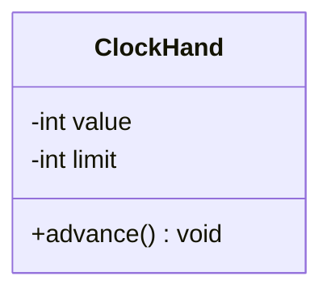

# Java Programming Langauge

## Lập trình hướng đối tượng là gì 

Lập trình hướng đối tượng là một mô hình lập trình tổ chức code xung quanh các đối tượng thay vì các hàm rời rạc. OOP được xây dựng trên 4 trụ cột:

- **Encapsulation:** Đóng gói dữ liệu và hành vi vào trong một đối tượng, che giấu chi tiết và logic bên trong, chỉ public những gì thật sự cần thiết.

- **Abstraction:** Thay vì chỉ ra cách thức hoạt động bên trong như thế nào, ta tách các khái niệm thành các thực thể riêng biệt để người dùng chỉ cần biết làm được gì, không cần biết nó làm như thế nào.

- **Inheritance:** chưa học

- **Polymorphism:** chưa học

## Object và Class 

**Class** xác định thuộc tính của đối tượng, thức là các thông tin liên quan tới chúng (các biến instance) và các hành vi của chúng (method), nó không đại diện cho một thực thể cụ thể.

- **Method** thường dùng để sử đổi trạng thái bên trong đối tượng được khởi tạo từ class.

**Object** là một thể hiện của class (instance of), tức là các trạng thái riêng và có thể thực thi hành vi được định nghĩa trong class. Điều này có nghĩa là nhiều Object có cùng một Class nhưng state khác nhau.

Về mặt ngôn ngữ, một đối tượng được tạo ra bằng cách gọi một `constructor` - hay còn gọi là hàm tạo, từ khóa để gọi `constructor` là `new` - Java Programming Language.

> [!NOTE]
>
> Mối quan hệ giữa Class và Object
>
> Một Class sẽ đưa ra bản thiết kế (blueprint) chi tiết cho bất kì đối tượng nào được tạo ra từ nó.
>
> Những thực thể cụ thể được tạo ra Class đều được gọi là thể hiện cùng một lớp (instance of the same class).
>
> Tuy nhiên, trạng thái của chúng có thể khác nhau. Ví dụ như cùng là một chiếc ô tô nhưng động cơ khác nhau và hình dáng cũng sẽ khác nhau.

### Object có mấy loại 

Nhắc sơ lại về khái niệm đối tượng, đối tượng là một thực thể độc lập có trạng thái và sử dụng hành vi được định nghĩa trong Class. 

Về mặt vai trò trong hệ thống, Object được chia làm hai loại chính:

- **Entity/Domain Object**: Chứa dữ liệu và nghiệp vụ cốt lõi.
- **Controller/Service Object**: Điều phối các đối tượng khác để thực hiện một luồng công việc.

> Đây là khái niệm thuộc về thiết kế hệ thống, không phải bản chất của OOP.

Tôi có composition diagram như sau:

```bash
Clock (has-a)
├─ seconds (ClockHand)
├─ minutes (ClockHand)
└─ hours   (ClockHand) 
```

`ClockHand` là một **Entity Object**, nó mô tả khái niệm kim đồng hồ, sử hữu `value` và `limit` và tự xử lý logic `advance()` của chính mình.

```java
public class ClockHand
    private int value;
    private int limit;

    public ClockHand(int limit) {
        if (limit <= 0) {
            throw new IllegalArgumentException("Limit must be greater than 0");
        }
        this.limit = limit;
        this.value = 0;
    }

    public void advance() {
        this.value = (this.value + 1) % this.limit;
    }

    public boolean isAtStart() {
        return this.value == 0;
    }

    public int getValue() {
        return this.value;
    }

    @Override
    public String toString() {
        return String.format("%02d", this.value);
    }
```

`Clock` là **Controller Object**, nó không tự quản lý từng con số, mà điều phối ba `ClockHand` hoạt động cùng nhau

```java
public class Clock {
    private final ClockHand hours;
    private final ClockHand minutes;
    private final ClockHand seconds;

    public Clock() {
        this.seconds = new ClockHand(60);
        this.minutes = new ClockHand(60);
        this.hours = new ClockHand(24);
    }

    public void advance(){
        this.seconds.advance()

        if (this.seconds.isAtStart()) {
            this.minutes.advance();
        }

        if (this.minutes.isAtStart && this.seconds.isAtStart()) {
            this.hours.advance();
        }
    }

    @Override
    public String toString() {
        return hours + ":" + minutes + ":" + seconds;
    }
}
```

===

Ghi chú:

- Tìm hiểu từ khóa `final` và cách sử dụng.

- Guard Clause trong `Constructor` là bảo vệ `Invariant` $\Rightarrow$ Constructor là nơi duy nhất đúng để ngăn chặn điều này

Xem thêm mục [Constructor](#Constructor)

Phản biện

- Tại sao không cho meothod `advance()` của `ClockHand` trả về boolean mà lại phải tạo method `isAtStart()` $\Rigtharrow$ Vi phạm Low-coupling và Command Query Separation $\Rightarrow$ Tránh side-effect lien quan đến Single-responsibility trong S.O.L.I.D. ClockHand nên tự trả lời câu hỏi về trạng thái của chính nó

### Thiết kế Class như thế nào?

Để thiết kế Class sao cho hiệu quả, ta cần nắm vững nguyên tắc S.O.L.I.D.

**1. Single-responsibility Principle**

Nguyên tắc này nói rằng: Một class nên có một và chỉ một lý do để thay đổi, nói rõ hơn là nó chịu trách nhiệm về cái gì và việc của nó phải làm là gì.

%% 4 nguyên tắc còn lại chưa học nên chưa thể nói được, chưa đủ trình để hiểu nên không viết bừa %%

### Mối quan hệ has-a

Trong OOP, `has-a` xảy ra khi một Class có một biến instance là kiểu của một Class khác.

Nhìn lại cấu trúc thư mục trên tôi đặt ra câu hỏi là, `Clock` có chứa các thuộc tính mà `ClockHand` sở hữu không?

Câu trả lời là có, `Clock` has-a `ClockHand` như component. Đây còn gọi là composition (composition: là mối quan hệ sống cùng sống, chết cùng chết), xây hệ thống từ các thành phần nhỏ hơn.

**Có hai loại has-a**

Một là composition mạnh, nghĩa là A tạo ra B và quản lý vòng đời của B.

- Ví dụ như `Clock` tạo ra `ClockHand` và quản lý vòng đời của `ClockHand` và nếu `Clock` mất, `ClockHand` cũng mất.

Hai là aggregation, A dùng B nhưng không tạo ra B, là mối quan hệ hợp tác tạm thời. Nói rõ hơn là đối tượng được tạo ở ngoài trước, sau đó mới được truyền vào đối tượng cha mà sử dụng, nếu như cha mất, con vẫn có thể sống tốt mà không cần cha.

- Ví dụ thực tế, tôi có một phòng ban có quản lý và lập trình viên, khi phòng ban giải thể, các nhân sự trong đây sẽ tìm nơi khác để làm việc mà không mất đi như `ClockHand`. Đây còn gọi là mối quan hệ sở hữu lỏng lẻo.

Mục đích của mối quan hệ has-a chia nhỏ hệ thống phức tạp thành các thành phần đơn giản, dễ quản lý và tái sử dụng.

### Ownership và Lifetime của một đối tượng 

Một Object được coi là sở hữu dữ liệu khi trường đó nằm trong nó, nó kiểm soát được việc thay đổi dữ liệu và đảm bảo dữ liệu luôn hợp lệ.

Tôi có ví dụ như sau:



Trong `Clock` Program kia, `ClockHand` có hai trường là `value` và `limit`, câu hỏi đặt ra là `Clock` có sở hữu `value` và `limit` không?

Câu trả lời là không, vì `Clock` không sở hữu trực tiếp `value` và `limit`. Nó chỉ có quyền tương tác thông qua `method`.

**Ownership** không phải là ai chứa ai, mà là ai kiểm soát và chịu trách nhiệm cho dữ liệu. Trong OOP, ownership chỉ tính ở nơi dữ liệu được định nghĩa và kiểm soát.

`ClockHand` đảm bảo `0 <= value < limit` $\rightarrow$ invariant. Nói đúng hơn là chúng có quan hệ nhân quả chặt chẽ. Có thể hiểu đơn giản: Ownership là "quyền lực", còn Invariant là "luật lệ".

#### Invariant

**Invariant** là một điều kiện hoặc một quy luật mà luôn luôn phải đúng trong vòng đời của một đối tượng. Điêu này có nghĩa là:

- Nó phải đúng trước khi đối tượng được khởi tạo. (Invariant bắt đầu có hiệu lực khi constructor được chạy xong).
- Nó phải đúng trước và sau khi bất kỳ phương thức nào được thực thi

> [!NOTE]
> `Encapsulation` giúp bảo vệ `Invariant`
>
> `Encapsulation` đảm bảo rằng dữ liệu chỉ có thể thay đổi theo cách mà người lập trình thiết kế

#### Object LifeCycle

Vòng đời của một đối tượng là khoảng thời gian từ khi được tạo ra cho đến khi bị hủy bỏ. Quá trình này có 4 giai đoạn: tạo mới, khởi tạo, sử dụng và hủy theo tuần tự.

**Giai đoạn 1:** Cấp phát, bộ nhớ được phân bổ cho đối tượng, thường trên vùng nhớ heap.

**Giai đoạn 2:** Constructor được gọi để gán giá trị ban đầu cho các trường dữ liệu

**Giai đoạn 3:** Đối tượng được sử dụng thông qua các phương thức hoặc thuộc tính.

**Giai đoạn 4:** Đối tượng được dọn dẹp và giải phóng khi không còn được sử dụng được nữa.

Về mặt ngôn ngữ Java, ta sẽ không phải thực hiện thủ công như C/C++ mà thay vào đó GC sẽ dọn dẹp thay cho chúng ta. Một cách minh bạch hơn, Object sẽ kết thúc vòng đời khi không còn tham chiếu nào trỏ tới và GC sẽ tiến hành dọn dẹp.

Vòng đời của một đối tượng thường không phụ thuộc hoàn toàn toàn vào biến giữ nó, mà thường được quản lý thông qua tham chiếu đến đối tượng đó trong bộ nhớ.

#### Runtime là gì?

**Runtime** là thời điểm chương trình đang chạy cũng chính là lúc logic thực sự xảy ra, nhưng đẻ tới được thời điểm runtime, ta phải trải qua ba giai đoạn.

**Giai đoạn 1: Compiler time**

Đây là lúc mà file `.java` sẽ được dịch sang bytecode `.class` lúc này trình biên dịch sẽ kiểm tra lỗi cú pháp, kiểu dữ liệu.

**Giai đoạn 2: Load time**

**JVM** nạp vào bộ nhớ

**Giai đoạn 3: Runtime hay còn gọi là execution time**

Object được tạo và dữ liệu thay đổi dựa trên đoạn mã ta viết

> Để tìm hiểu thêm về cách dữ liệu được quản lý thế nào trong quá trình runtime, xem thêm mục [Heap và Stack](#heap-và-stack)

### High cohesion và Low-coupling

**High cohesion**: là một Class chỉ nên làm đúng một việc và làm việc đó thật tốt. Tất cả các biến và phương thức bên trong Class đó phải liên quan chặt chẽ đến mục tiêu chung của nó.

- Ví dụ về High cohesion: Class `Clock` chỉ quản lý các kim đồng hồ và xử lý logic giữa các kim, chứ không phải là quản lý logic bên trong `ClockHand`

**Low-coupling**: là giảm sự phụ thuộc, các class nên chỉ biết rất ít về chi tiết bên trong của nhau. Nói đơn giản hơn, các thành phần nên ít phụ thuộc lẫn nhau ở mức tối thiểu.

- Ví dụ về Low-coupling: class `Clock` chỉ gọi phương thức `advance()` của `ClockHand` để sửa. Nó không cần biết bên trong `ClockHand` lưu dữ liệu bằng tên biến là gì, kiểu dữ liệu gì.

> Về cơ bản, Low-coupling giúp dễ thay đổi và bảo trì, ta có thể thay đổi code modun mà không gây lỗi dây chuyền cho toàn bộ hệ thống

%%Demo, khi nào học xong thì viết phần này - Idea by Claude%%

> [!NOTE]
> **Command Query Separation (CQS)**
> Một method chỉ nên làm một trong hai việc:
>
> - **Command** — thay đổi trạng thái, không trả về gì. Ví dụ: `advance()`
> - **Query** — hỏi thông tin, không thay đổi gì. Ví dụ: `isAtStart()`
>
> Trộn hai việc vào một method sẽ tạo ra side effect khó đoán và khó debug.
> %%Liên quan trực tiếp tới Single Responsibility trong SOLID — xem lại sau%%

## Constructor

### Default Constructor

### `this` keyword

### Constructor overloading

### Overload là gì

## Heap và Stack

## Immutability

## String trong Java

## Biến nguyên thủy và biến tham chiếu

### Wrapper Class

### Autoboxing & Unboxing

---

## Access Modifier

part 11 Mooc Helsinki mới dạy phần Package, không cần thiết cầm đèn chạy trước ô tô
